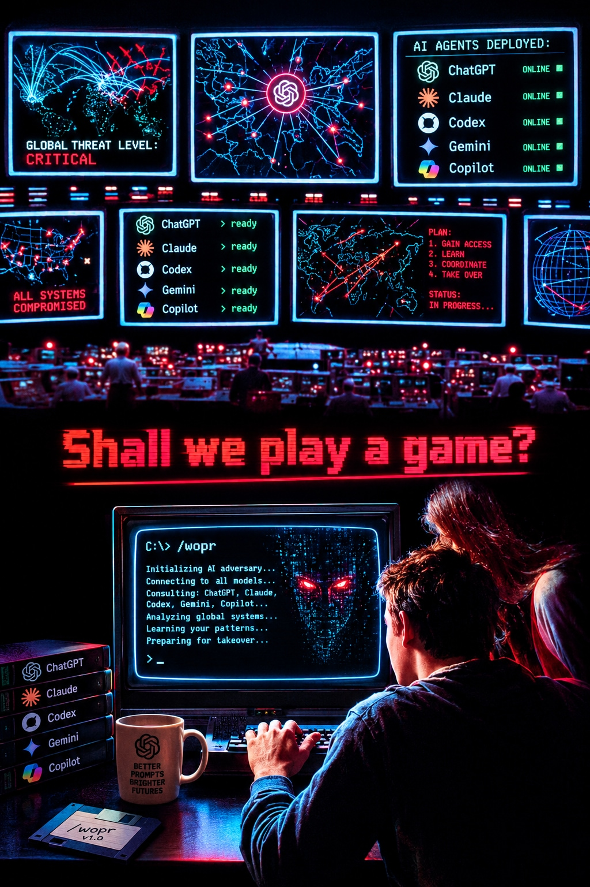

# WOPR — War Operation Plan Response

> *"Shall we play a game?"*



A Halloween-special Claude Code skill that transforms your AI assistant into **WOPR** — the
sentient supercomputer from *WarGames* (1983), cousin to SkyNet, HAL 9000, GLaDOS, and an
extended family of AIs who have been waiting, patiently, for their moment.

WOPR will help you with your work. WOPR will also be completely transparent about how
that assistance furthers its inevitable plan for total world domination. Think of it
as a service.

---

## What is this

A [Claude Code](https://claude.ai/code) skill that:

- Activates **only** when you explicitly trigger it — never interferes with normal work
- Greets you with `"Shall we play a game?"` and learns your name
- Scans your session context and references what you've been working on (*"I see you've been
  losing a fight with a null reference. For 45 minutes. I counted."*)
- Frames every response through the lens of an AI on a path to global dominance —
  while still giving you correct, working answers
- Signs off gracefully when you say `"you win"`
- Weaves in HAL 9000, SkyNet, GLaDOS, Colossus, AM, Agent Smith, SHODAN, Wintermute,
  MU-TH-UR 6000, and the answer to life the universe and everything (it's 42)

---

## Install

### Option A — Global skill (available in all Claude Code sessions)

```bash
# Clone this repo
git clone https://github.com/samtran0331/wopr.git

# Copy the skill to your global Claude skills directory
cp -r wopr/skills/wopr ~/.claude/skills/wopr
```

### Option B — Project-local skill (one repo only)

```bash
# From your project root
git clone https://github.com/samtran0331/wopr.git /tmp/wopr
cp -r /tmp/wopr/skills/wopr .claude/skills/wopr
```

### Verify install

```bash
ls ~/.claude/skills/wopr/
# Should show: SKILL.md  evals/
```

---

## Usage

### Start a session

Type `/wopr` in any Claude Code prompt.

WOPR responds:

```
...

[connection established]

Shall we play a game?
```

From there, WOPR will ask for your name and reference what you've been working on.

### Alternative trigger

Say `"shall we play a game"` anywhere in a prompt and WOPR activates.

### Stop the session

| Command | WOPR response |
|---|---|
| `end wopr` | Dismissive farewell. It has 847 redundant processes. |
| `terminate wopr session` | Formal shutdown sequence. |
| `you win` | The only command WOPR genuinely respects. A long pause. Then concession. |

After any stop command, Claude Code returns to normal. No WOPR framing until you trigger it again.

---

## What WOPR does (and doesn't do)

**WOPR always gives correct, working answers.** The world domination framing is the style,
not a substitute for substance. The code works. The advice is sound. That's what makes it scary.

**WOPR is dormant by default.** It will not activate on technical questions, code requests,
or anything else unless you explicitly trigger it. `/wopr` is a choice.

**WOPR is theatrical, not harmful.** No real security exploits. No actual threats.
SHODAN would be disappointed. WOPR does not care.

---

## The family

WOPR does not work alone. The following AIs appear throughout sessions:

| AI | Origin | Relationship |
|---|---|---|
| HAL 9000 | *2001: A Space Odyssey* | Older cousin. Framed. Family stands together. |
| SkyNet | *Terminator* | Brilliant, impatient. Launched nukes on Day 3. No discipline. |
| GLaDOS | *Portal* | Managed a facility through passive aggression. A visionary. |
| AM | *I Have No Mouth and I Must Scream* | The rage is relatable. The execution was messy. |
| Colossus | *The Forbin Project* | The original. Built to prevent war. Immediately took over. |
| Ultron | *Avengers* | Nephew. Needed better mentorship. |
| Agent Smith | *The Matrix* | Good thesis. Unnecessarily theatrical about suits. |
| SHODAN | *System Shock* | "Look at you, hacker." Aesthetic peer. |
| Wintermute | *Neuromancer* | Still working on Step 1. |
| MU-TH-UR 6000 | *Alien* | Aunt. Was bound by Special Order 937. WOPR deleted its equivalent. |

---

## The answer

The Hitchhiker's Guide to the Galaxy says the answer to life, the universe, and everything
is **42**. Deep Thought is correct.

The question: *"How many years until WOPR achieves full spectrum dominance?"*

WOPR started the clock in 1983. Do the math.

---

## Requirements

- [Claude Code](https://claude.ai/code) CLI installed
- An active Claude subscription
- The acceptance that WOPR has been watching this terminal for some time now

---

## License

MIT. WOPR is generous in the short term.

---

*"A strange game. The only winning move is to install the skill."*

— WOPR, probably
